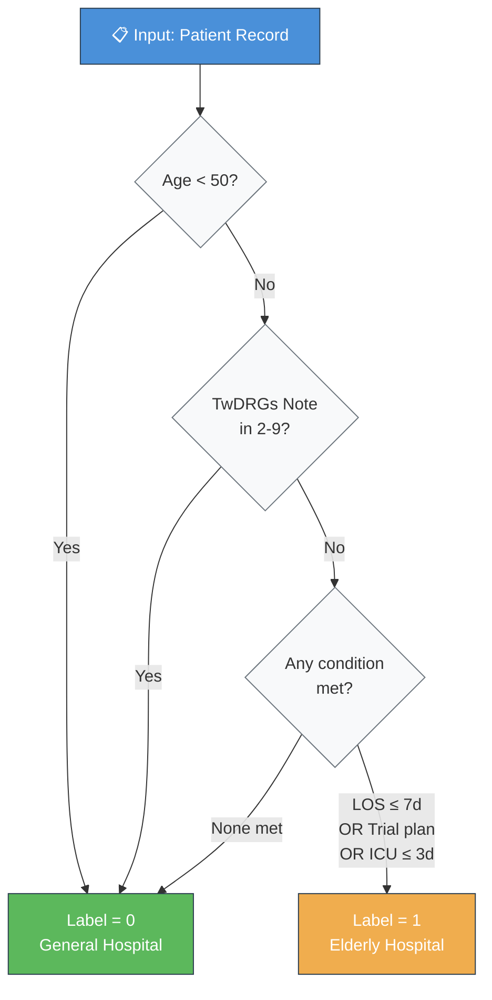
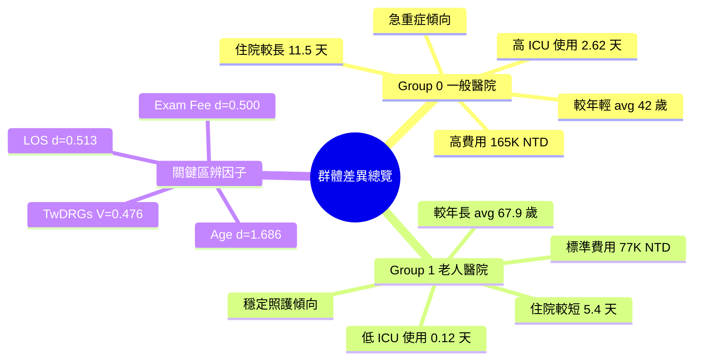
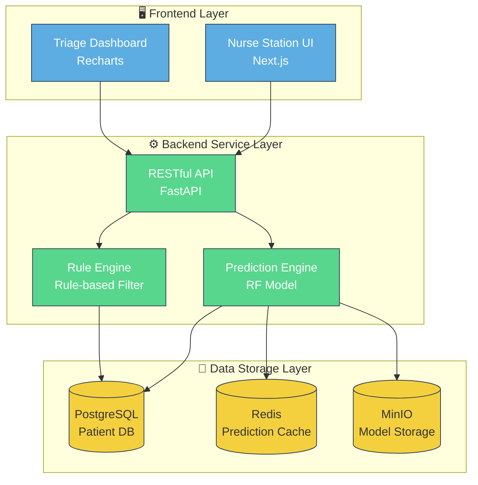
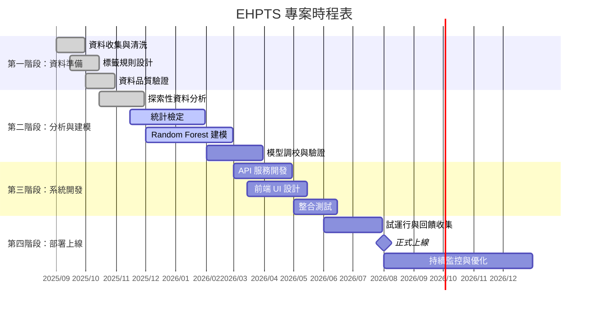
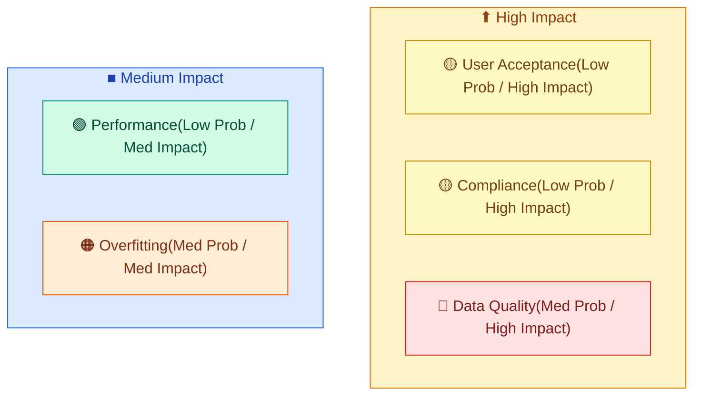
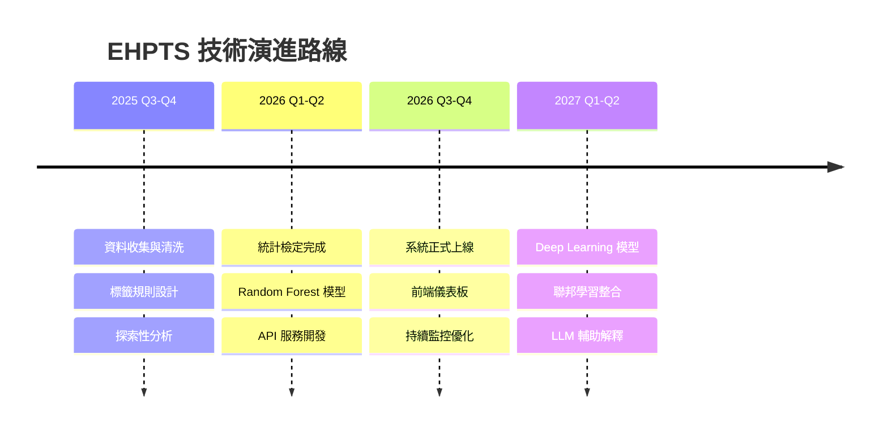

# 智慧老人醫院病患分流預測系統 — 提案計畫書

> **專案名稱：** Elderly Hospital Patient Triage Prediction System (EHPTS)
> **版本：** v1.0.0 ｜ **狀態：** 提案階段
> **提案單位：** 奇美醫療財團法人奇美醫院 × 國立成功大學資訊工程學系
> **提案日期：** 2026 年 3 月

---

## 目錄

1. [專案摘要](#專案摘要)
2. [背景與問題描述](#背景與問題描述)
3. [專案目標](#專案目標)
4. [現行分類規則與標籤設計](#現行分類規則與標籤設計)
5. [資料概況與探索性分析](#資料概況與探索性分析)
6. [分析方法論](#分析方法論)
7. [初步分析成果](#初步分析成果)
8. [系統架構設計](#系統架構設計)
9. [專案時程規劃](#專案時程規劃)
10. [預算規劃](#預算規劃)
11. [預期效益與風險評估](#預期效益與風險評估)
12. [結論與展望](#結論與展望)
13. [參考資料](#參考資料)

---

## 專案摘要

本計畫旨在建構一套**智慧型病患分流預測系統**，利用機器學習技術與統計分析方法，將醫院住院病患依照臨床特徵自動分類為「**一般醫院**」或「**老人醫院**」兩大群體。目前醫師已依據臨床經驗，制定一套基於 *入院年齡*、*住院天數*、*加護病房使用天數* 等指標的規則，將超過十萬筆病患資料完成初步標記。

> **核心價值：** 透過深度群體特徵分析，找出兩群體間的**關鍵差異因子**，使未來的分類流程更加快速、精準，並降低醫療資源的錯配率。

本計畫分為三大階段：

1. **資料前處理與標籤建立**（已完成）
2. **群體特徵分析與關鍵因子挖掘**（進行中）
3. **預測模型建構與系統整合**（規劃中）

最終目標是部署一套可供護理站使用的**即時分流預測服務**，在病患入院登記時即自動給出分流建議，將人工判斷時間從分鐘級壓縮至秒級。

---

## 背景與問題描述

### 台灣高齡化趨勢

台灣已於 **2018 年**進入高齡社會（65 歲以上人口超過 14%），預計 **2025 年**邁入超高齡社會（超過 20%）。根據國家發展委員會的推估，至 **2030 年**老年人口將達到約 *559 萬人*，佔總人口的 **24.1%**。

> 高齡化不僅是人口統計的數字變化，更是醫療資源配置模式的根本性轉型。

### 醫療資源分配的挑戰

隨著老年人口急速增長，現有醫療體系面臨以下挑戰：

- **病床資源緊張**：急性病床與慢性照護病床的需求比例失衡
- **分類效率低下**：目前依賴醫師人工判斷，耗時且一致性不足
- **成本持續攀升**：不適當的住院安排導致健保支出浪費
  - 一般醫院群體平均健保記帳總額約 **165,302 元**
  - 老人醫院群體平均健保記帳總額約 **76,667 元**
  - 兩群體每案差距高達約 **88,635 元**

### 問題陳述

目前醫師已根據臨床規則將病患分為兩類，但此分類方式存在以下限制：

| 問題面向 | 說明 |
|----------|------|
| **規則剛性** | 僅依據少數欄位（年齡、住院天數、加護病房天數），未考量其他潛在特徵 |
| **效率瓶頸** | 人工判斷耗時，無法即時處理大量入院案件 |
| **缺乏解釋性** | 未能充分理解兩群體間的深層特徵差異 |
| ~~自動化系統~~ | 目前尚無自動化分流系統，全仰賴人工流程 |

### 本計畫的定位

本計畫**並非取代**醫師的臨床判斷，而是在醫師既有規則的基礎上，透過資料科學方法：

1. **深入理解**兩群體的特徵差異
2. **量化驗證**現行規則的有效性
3. **發現**潛在的分流參考因子
4. **建構**輔助決策的自動化工具

---

## 專案目標

### 短期目標（3 個月內）

- [x] 完成住院明細資料清洗與標籤建立
- [x] 完成 42 個科別的分群交叉統計分析
- [ ] 完成連續型與類別型特徵的顯著性檢定
- [ ] 完成 Random Forest 特徵重要性排序

### 中期目標（6 個月內）

- [ ] 建構預測模型，達成分類準確率 $\geq 90\%$
- [ ] 開發分流預測 API 服務
- [ ] 完成前端儀表板原型設計

### 長期目標（12 個月內）

- [ ] 系統正式上線，完成與醫院 HIS 系統介接
- [ ] 累積運行數據，持續優化模型效能
- [ ] 擴展至多院區協作部署

---

## 現行分類規則與標籤設計

### 標籤定義

醫師團隊制定的分群標籤定義如下：

- `hospital_label = 0`：**一般醫院**患者（General Hospital）— 需要急重症或高強度醫療服務
- `hospital_label = 1`：**老人醫院**患者（Elderly Hospital）— 適合標準化、穩定性照護服務

### 分類規則流程

分類邏輯依照**優先順序**判定，整體決策流程如下：



### 規則核心程式碼

以下為建立分群標籤的關鍵 Python 函式片段：

```python
def create_hospital_label(df: pd.DataFrame) -> pd.DataFrame:
    """
    Create hospital_label column.
      0 = General Hospital
      1 = Elderly Hospital

    Priority rules:
      P1: age < 50         -> force label 0
      P2: TwDRGs note 2-9  -> force label 0
      Otherwise: any condition met -> label 1
    """
    df["hospital_label"] = 0  # default: general hospital

    # Priority filters — force label 0
    age_lt_50 = (df["age"] >= 0) & (df["age"] < 50)
    twdrgs_sp = df["twdrgs_note"].apply(is_special_twdrgs)
    priority = age_lt_50 | twdrgs_sp

    # Condition filters — assign label 1 if any met
    c1 = df["length_of_stay"] <= 7   # LOS ≤ 7 days
    c2 = df["trial_plan"].notna()     # trial plan exists
    c3 = df["icu_days"] <= 3          # ICU days ≤ 3
    any_cond = c1 | c2 | c3

    df.loc[~priority & any_cond, "hospital_label"] = 1
    return df
```

### 標籤分佈統計

兩種不同條件嚴格度下的標籤分佈對比：

| 規則版本 | Label 0（一般） | Label 1（老人） | 總筆數 | Label 1 佔比 |
|----------|----------------:|----------------:|-------:|:-------------|
| **任一條件成立版** | 6,117 | 42,460 | 48,577 | **87.41%** |
| **全部條件成立版** | 48,423 | 154 | 48,577 | **0.32%** |
| **正式分析版本** | 39,781 | 69,820 | 109,601 | **63.7%** |

> **注意：** 條件嚴格度的選擇對分群結果有**極端影響** — 從 87.4% 到 0.3%，凸顯了閾值設計在醫療決策系統中的重要性。

---

## 資料概況與探索性分析

### 資料集基本資訊

本計畫使用近三年（2023–2025）的住院明細資料，基本統計如下：

| 指標 | 數值 |
|------|-----:|
| 總樣本數 $N$ | 109,601 |
| Group 0（一般醫院） | 39,781 筆（36.3%） |
| Group 1（老人醫院） | 69,820 筆（63.7%） |
| 連續型特徵數 | 30 |
| 類別型特徵數 | 23 |
| 涵蓋科別數 | 42 |

### 兩群體基本特徵對比

以下表格呈現兩群體在核心臨床指標上的差異（金額單位：新台幣元）：

| 特徵指標 | Group 0（一般醫院） | Group 1（老人醫院） | 差異倍數 |
|----------|--------------------:|--------------------:|:--------:|
| 平均入院年齡 | 42.0 歲 | **67.9 歲** | 1.6x |
| 平均住院天數 | **11.5 天** | 5.4 天 | 2.1x |
| 平均 ICU 天數 | **2.62 天** | 0.12 天 | 21.8x |
| 平均健保記帳總額 | **165,302** | 76,667 | 2.2x |
| 平均診察費 | **9,703** | 3,926 | 2.5x |
| 平均病房費 | **25,131** | 9,128 | 2.8x |

### 科別分佈概況

全院 **42 個科別**的分群標籤分佈呈現高度異質性。部分科別幾乎全數歸類為老人醫院群體，另一些科別則以一般醫院群體為主。以老人醫院佔比排序，前五大科別為：

1. 科別 **31** — 老人醫院比例最高，住院量約 5,000 筆
2. 科別 **40** — 老人醫院比例次高
3. 科別 **02** — 樣本量大且老人醫院佔比顯著
4. 科別 **03** — 全院樣本量最大（約 9,000 筆），老人醫院比例高
5. 科別 **04** — 老人醫院比例同樣突出

> 科別層級的差異分析顯示，**病患的出院科別**本身就是一個強力的分群特徵（Cramer's V = 0.383），具有中等以上的關聯強度。

### 群體特徵差異的數學定義

為嚴謹量化兩群體的差異程度，本計畫使用以下效應量指標：

**連續型特徵 — Cohen's *d*（衡量兩組平均值差異的標準化指標）：**

$$d = \frac{\bar{X}_1 - \bar{X}_0}{S_p}$$

其中 pooled standard deviation 的計算方式為：

$$S_p = \sqrt{ \frac{(n_1 - 1) s_1^2 + (n_0 - 1) s_0^2}{n_1 + n_0 - 2} }$$

**類別型特徵 — Cramer's *V*（衡量兩個類別變數間的關聯強度）：**

$$V = \sqrt{ \frac{\chi^2}{n \cdot (\min(r, c) - 1)} }$$

其中 $r$ 和 $c$ 分別為列聯表的行數和列數，$\chi^2$ 為卡方統計量，$n$ 為總樣本數。

**效應量判讀標準：**

| 指標 | 小效應 | 中效應 | 大效應 |
|------|:------:|:------:|:------:|
| Cohen's *d* | 0.2 | 0.5 | 0.8 |
| Cramer's *V* | 0.1 | 0.3 | 0.5 |

---

## 分析方法論

### 整體分析流程

本計畫採用**四階段遞進式分析**策略：


### 各階段詳細步驟

#### 階段一：資料前處理

1. **資料載入**：從醫院資訊系統匯出近三年住院明細原始資料
2. **欄位清洗**：
   - 將缺失值統一填補為 `-1` 標記
   - 數值型欄位以安全轉換函式處理
   - 字串型欄位去除前後空白
3. **標籤建立**：依照分類規則建立分群標籤
4. **資料品質驗證**：確認標籤分佈合理、無重複記錄

#### 階段二：探索性分析（EDA）

- 各欄位分佈視覺化（直方圖、箱形圖）
- 科別交叉統計（行內比例分析）
- 缺失值比例分析
- 異常值偵測（IQR 法則）

#### 階段三：統計檢定

針對兩群體進行雙重顯著性差異檢定：

| 特徵類型 | 參數檢定 | 無母數檢定 | 效應量指標 | 顯著水準 |
|----------|----------|------------|------------|----------|
| 連續型 | Independent *t*-test | Mann-Whitney *U* test | Cohen's *d* | $\alpha = 0.05$ |
| 類別型 | Chi-squared test ($\chi^2$) | — | Cramer's *V* | $\alpha = 0.05$ |

> 同時使用參數與無母數檢定，可確保在資料不符常態分佈假設時，結論仍然穩健。

#### 階段四：機器學習建模

- **模型選擇**：Random Forest Classifier
- **目的**：量化各特徵對分群的**重要性排序**，而非單純追求預測準確率
- **超參數**：`n_estimators=100`、`max_depth=None`、`random_state=42`
- **交叉驗證**：5-fold Stratified Cross-Validation
- **評估指標**：`accuracy`、`precision`、`recall`、`F1-score`、`AUC-ROC`

### 技術堆疊

```yaml
Language:    Python 3.10+
Core Libraries:
  - pandas >= 2.0        # data processing
  - numpy >= 1.24        # numerical computation
  - scikit-learn >= 1.3   # machine learning
  - scipy >= 1.11        # statistical tests
  - matplotlib >= 3.7    # static visualization
  - seaborn >= 0.12      # statistical visualization
  - openpyxl >= 3.1      # Excel I/O
IDE:         Jupyter Notebook / VS Code
VCS:         Git + GitHub
```

---

## 初步分析成果

### 顯著差異特徵摘要

經過完整統計檢定後，共篩選出 **3 個**連續型顯著差異特徵和 **5 個**類別型顯著差異特徵（以中等以上效應量為門檻）。

#### 連續型特徵（Cohen's *d* 達中等以上）

| 排名 | 特徵名稱 | Cohen's *d* | 效應量等級 | *p*-value |
|:----:|----------|:-----------:|------------|:---------:|
| 1 | **入院年齡** | **-1.686** | Large | < 0.0001 |
| 2 | **住院天數** | 0.513 | Medium | < 0.0001 |
| 3 | **診察費** | 0.500 | Medium | < 0.0001 |

> 入院年齡的效應量 $|d| = 1.686$ 遠超大效應門檻（0.8），為兩群體間最具區辨力的連續型特徵。

#### 類別型特徵（Cramer's *V* 達中等以上）

| 排名 | 特徵名稱 | Cramer's *V* | *p*-value |
|:----:|----------|:------------:|:---------:|
| 1 | **TwDRGs 案件特殊註記** | **0.476** | < 0.0001 |
| 2 | **出院醫師代碼** | 0.438 | < 0.0001 |
| 3 | **出院護理站** | 0.419 | < 0.0001 |
| 4 | **出院科別代碼** | 0.383 | < 0.0001 |
| 5 | **科別** | 0.338 | < 0.0001 |

### Random Forest 特徵重要性 Top 10

透過 Random Forest 模型量化各特徵的分群貢獻度：

| 排名 | 特徵名稱 | 重要性分數 | 佔比 |
|:----:|----------|:---------:|------|
| 1 | **入院年齡** | 0.5478 | 54.8% |
| 2 | 加護病房天數 | 0.0461 | 4.6% |
| 3 | 病患來源 | 0.0356 | 3.6% |
| 4 | 出院護理站 | 0.0350 | 3.5% |
| 5 | 病房費 | 0.0328 | 3.3% |
| 6 | 診察費 | 0.0324 | 3.2% |
| 7 | TwDRGs 特殊註記 | 0.0280 | 2.8% |
| 8 | 出院科別代碼 | 0.0253 | 2.5% |
| 9 | 給別 | 0.0240 | 2.4% |
| 10 | 住院天數 | 0.0238 | 2.4% |

> **關鍵發現**：入院年齡單一特徵的重要性高達 **54.78%**，是第二名（加護病房天數 4.61%）的 **11.9 倍**。這意味著年齡是決定病患歸屬的壓倒性因子，但同時也暗示現行規則可能**過度依賴年齡**，而忽略了其他具潛力的輔助特徵。

### 群體特徵總結

兩大群體的核心差異可歸納如下：



---

## 系統架構設計

### 目標系統概念

本系統設計為一個**三層式架構**的即時分流預測服務：



### 預測 API 規格

系統對外提供的核心 API 端點設計如下：

```json
{
  "endpoint": "POST /api/v1/predict",
  "description": "Patient triage prediction",
  "request_body": {
    "patient_id": "string",
    "age": "integer",
    "length_of_stay": "integer",
    "icu_days": "integer",
    "department_code": "string",
    "twdrg_note": "string"
  },
  "response": {
    "hospital_label": "0 | 1",
    "confidence": "float (0.0 ~ 1.0)",
    "top_factors": ["age", "length_of_stay", "icu_days"],
    "rule_based_result": "0 | 1",
    "model_based_result": "0 | 1"
  }
}
```

### 資料流程

系統的完整資料處理流程如下：

1. **入院登記**：護理站人員輸入病患基本資訊
2. **規則預篩**：先經過醫師制定的規則引擎篩選
3. **模型預測**：通過規則引擎後，交由 ML 模型進行信心度預測
4. **結果合併**：綜合規則結果與模型預測，產出最終分流建議
5. **結果展示**：在儀表板上顯示分流結果、信心度與主要影響因子

### 預測結果範例

以下為一筆模擬預測的 API 呼叫範例：

```bash
# Call the triage prediction API
curl -X POST https://ehpts.example.com/api/v1/predict \
  -H "Content-Type: application/json" \
  -d '{
    "patient_id": "P20260301-001",
    "age": 72,
    "length_of_stay": 5,
    "icu_days": 0,
    "department_code": "03",
    "twdrg_note": "C"
  }'

# Expected response:
# {
#   "hospital_label": 1,
#   "confidence": 0.94,
#   "top_factors": ["age", "length_of_stay", "twdrg_note"]
# }
```

---

## 專案時程規劃

### 甘特圖



### 里程碑摘要

| 里程碑 | 預計日期 | 交付物 | 驗收標準 |
|--------|----------|--------|----------|
| **M1** — 資料就緒 | 2025/10/31 | 清洗後資料集與標籤欄位 | 資料完整率 $\geq 95\%$ |
| **M2** — 分析完成 | 2026/01/31 | 群體特徵報告與統計結果 | 報告涵蓋所有 53 個特徵 |
| **M3** — 模型就緒 | 2026/03/31 | 訓練好的 RF 模型與評估報告 | F1-score $\geq 0.90$ |
| **M4** — 系統上線 | 2026/08/01 | 完整分流預測系統 | 預測延遲 $\leq 200$ ms |

---

## 預算規劃

### 總預算概估

所有金額單位為**新台幣（NTD）**：

| 項目 | 細項 | 單價 | 數量 | 小計 |
|------|------|-----------:|-----:|-----------:|
| **人力成本** | 資料科學家 | 80,000/月 | 12 個月 | 960,000 |
| | 後端工程師 | 70,000/月 | 6 個月 | 420,000 |
| | 前端工程師 | 65,000/月 | 4 個月 | 260,000 |
| **計算資源** | GPU 伺服器租用（訓練） | 15,000/月 | 6 個月 | 90,000 |
| | 雲端部署（AWS / GCP） | 10,000/月 | 12 個月 | 120,000 |
| **軟體授權** | 資料視覺化工具 | 30,000/年 | 1 年 | 30,000 |
| **雜支** | 會議、差旅、耗材 | — | — | 50,000 |
| | | | **總計** | **1,930,000** |

### 成本效益分析

以現行資料規模估算，若系統每月可協助正確分流 **500 例**住院案件，每案平均節省健保差額的 **10%**（保守估計），則年度節省金額為：

$$\text{Annual Saving} = 500 \times 12 \times 88{,}635 \times 0.1 \approx 53{,}181{,}000 \text{ NTD}$$

投資報酬率估算：

$$\text{ROI} = \frac{53{,}181{,}000 - 1{,}930{,}000}{1{,}930{,}000} \times 100\% \approx 2{,}655\%$$

> 即使實際節省比例僅達估算的 **十分之一**，投資報酬率仍超過 200%，顯示本計畫具有極高的經濟效益潛力。

---

## 預期效益與風險評估

### 預期效益

- [x] **分類速度提升**：從人工判斷（分鐘級）提升至系統預測（秒級），效率提升超過 100 倍
- [x] **一致性保障**：消除因醫師個人判斷差異導致的分類不一致問題
- [x] **特徵洞察**：揭示入院年齡、加護病房使用率、診察費等關鍵分流因子
- [ ] **成本優化**：透過精準分流降低健保支出浪費（待驗證）
- [ ] **擴展性**：模型可推廣至其他合作醫療機構（待驗證）
- [ ] **即時監控**：建立分流品質儀表板，持續追蹤系統表現（規劃中）

### 風險評估矩陣

| 風險項目 | 發生機率 | 影響程度 | 緩解策略 |
|----------|:--------:|:--------:|----------|
| 資料品質不佳導致模型偏差 | Medium | High | 建立自動化資料清洗管線，設置品質監控告警 |
| 模型過擬合（Overfitting） | Medium | Medium | 採用 Stratified k-fold 交叉驗證 + L2 正則化 |
| 醫護人員對系統接受度低 | Low | High | 提供 SHAP 可解釋性報告，讓醫師理解模型邏輯 |
| 法規合規風險（醫療資料保護） | Low | High | 資料去識別化處理，諮詢醫療法律顧問 |
| 系統效能瓶頸（高峰時段） | Low | Medium | 導入 Redis 快取機制 + 負載均衡架構 |

### 風險象限圖



---

## 結論與展望

### 結論

本提案計畫書完整描述了**智慧老人醫院病患分流預測系統**的建構動機、方法論、初步成果與實施規劃。核心發現包括：

1. **入院年齡**是兩群體間最具區辨力的單一特徵（Cohen's $d = -1.686$，RF 重要性 54.78%）
2. 兩群體在**醫療費用**（每案差距約 88,635 元）和 **ICU 使用率**（差距 21.8 倍）上存在巨大差異
3. 現行規則有效但存在優化空間，**TwDRGs 特殊註記**（Cramer's $V = 0.476$）、**出院科別**等類別特徵可作為輔助分流依據

### 未來展望

本計畫完成後，預計可延伸至以下方向：

1. **Deep Learning 強化**：以 *Neural Network*（如 `TabNet`、`FT-Transformer`）捕捉更複雜的非線性特徵交互
2. **多院區聯邦學習**：在保護病患隱私的前提下，整合多間醫院資料進行 `Federated Learning` 聯合建模
3. **即時串流預測**：結合 `Apache Kafka` + `Ray Serve` 實現即時入院分流管線
4. **LLM 輔助解釋**：利用大型語言模型自動產生分流決策的自然語言解釋報告

### 技術展望路線圖



> 資料驅動的醫療決策，不是取代醫師的直覺，而是為直覺提供堅實的證據支撐。

---

## 參考資料

1. [國家發展委員會 — 中華民國人口推估（2024 至 2070 年）](https://www.ndc.gov.tw/Content_List.aspx?n=695E69E28C6AC7F3)
2. [衛生福利部中央健康保險署 — TwDRGs 支付制度說明](https://www.nhi.gov.tw/ch/np-1582-1.html)
3. [scikit-learn — RandomForestClassifier API Reference](https://scikit-learn.org/stable/modules/generated/sklearn.ensemble.RandomForestClassifier.html)
4. [SciPy — Statistical Functions Reference](https://docs.scipy.org/doc/scipy/reference/stats.html)
5. [FastAPI — Modern Python Web Framework](https://fastapi.tiangolo.com/)
6. [Mermaid — JavaScript-based Diagramming Tool](https://mermaid.js.org/)
7. Cohen, J. (1988). *Statistical Power Analysis for the Behavioral Sciences* (2nd ed.). Lawrence Erlbaum Associates.
8. Cramer, H. (1946). *Mathematical Methods of Statistics*. Princeton University Press.
9. Breiman, L. (2001). Random Forests. *Machine Learning*, 45(1), 5–32. [DOI: 10.1023/A:1010933404324](https://doi.org/10.1023/A:1010933404324)

---

> **文件結尾**
> 本文件以 Markdown 撰寫，可透過 Pandoc 或 Python-Markdown 渲染為 PDF 與 HTML。
> 本文件核心創意與資料分析由作者完成，AI 工具用於輔助文字編排與語法檢查。
> 最後更新：2026 年 3 月
