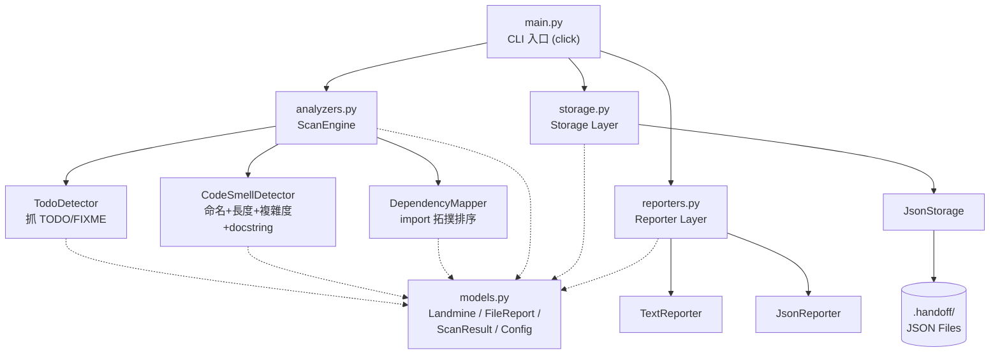
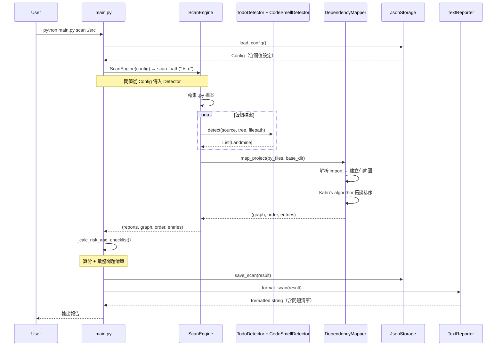

# handoff v1.0 — Software Design Document (SDD)

## 1. 專案概覽（Project Overview）

- **程式名稱**：handoff
- **版本**：v1.0
- **一句話描述（Elevator Pitch）**：一個 Python CLI 工具，在你接手別人的程式碼之前幫你「掃雷」——自動找出 TODO 沒做完、函式沒寫 docstring、命名亂七八糟等交接地雷，同時根據 import 依賴產生建議閱讀順序，最後輸出一份「交接問題清單」讓你可以直接拿去找前手確認。
- **目標使用者**：需要接手學長姊或離職同事專案的工程師、實習生，以及要快速評估學生程式碼品質的助教。
- **核心價值**：
  - **地雷偵測**：不只看 code style，還會抓 TODO/FIXME 未完成標記、缺少 docstring 的 public API、過長函式、過高複雜度——這些才是交接時真正會炸的東西。
  - **交接問題清單**：每顆地雷都附帶一句「建議問前手的問題」，彙整成 checklist，可以直接拿去跟學長姊對帳。
  - **閱讀導航**：用拓撲排序產生「該從哪個檔案開始讀」的建議順序，並標記 entry point，讓新人不用瞎猜。
  - **歷史追蹤**：每次掃描自動存檔，可以比較修復前後的風險分數變化，確認地雷真的有排掉。

### 開發動機

去年暑假在公司實習的時候，被指派接手一位學長的內部工具。那個專案大概十幾支 Python 檔案，沒有 README、沒有 docstring、到處都是 `TODO: fix later` 但從來沒 fix 過。最慘的是學長已經離職了，問不到人。我花了快兩週才搞懂程式碼在做什麼，中間踩了無數地雷。後來我在想，如果當初有一個工具能在學長離職前就幫我列出「這些地方你應該先問清楚」，也許一天就能搞定。這就是 handoff 的原點。

---

## 2. CLI 介面規格（Interface Specification）

### `python main.py <command> [options]`

| 指令 | 參數 / 旗標 | 說明 | 範例 |
|---|---|---|---|
| `scan` | `PATH`（必填） | 掃描指定檔案或目錄，找出交接地雷 | `python main.py scan ./src` |
| | `--format text\|json` | 輸出格式，預設 `text` | `python main.py scan main.py --format json` |
| | `--output FILE` / `-o FILE` | 將報告寫入檔案 | `python main.py scan . -o report.txt` |
| `report` | `--id INT` | 顯示指定 ID 的歷史掃描報告 | `python main.py report --id 3` |
| | `--latest` | 顯示最近一次掃描報告 | `python main.py report --latest` |
| | `--format text\|json` | 輸出格式，預設 `text` | `python main.py report --latest --format json` |
| `history` | `--limit INT` | 列出歷史掃描紀錄，預設最多 10 筆 | `python main.py history --limit 5` |
| | `--format text\|json` | 輸出格式，預設 `text` | `python main.py history --format json` |
| `compare` | `ID1 ID2`（必填） | 比較兩次掃描結果 | `python main.py compare 1 2` |
| | `--format text\|json` | 輸出格式，預設 `text` | `python main.py compare 1 2 --format json` |
| `config` | `--show` | 顯示目前設定 | `python main.py config --show` |
| | `--set KEY=VALUE` | 修改閾值設定 | `python main.py config --set max_complexity=15` |

### 全域選項

| 旗標 | 說明 |
|---|---|
| `--version` | 顯示版本號 |
| `--help` | 顯示指令說明 |

---

## 3. 資料模型（Data Model）

### Landmine（地雷）

交接時可能出問題的每一個點，都是一顆地雷。

| 欄位 | 型別 | 說明 | 必填 |
|---|---|---|---|
| kind | str | 地雷類型（`todo` / `missing_docstring` / `naming` / `long_func` / `high_complexity` / `syntax_error`） | ✅ |
| filepath | str | 所在檔案 | ✅ |
| line | int | 行號 | ✅ |
| message | str | 問題描述 | ✅ |
| severity | str | 嚴重程度（`low` / `medium` / `high`），預設 `medium` | ✅ |
| suggested_question | str | 建議問前手的問題，用於交接問題清單 | ❌ |

### FileReport（檔案報告）

| 欄位 | 型別 | 說明 | 必填 |
|---|---|---|---|
| filepath | str | 檔案路徑 | ✅ |
| line_count | int | 有效程式碼行數 | ✅ |
| function_count | int | 函式數 | ✅ |
| class_count | int | 類別數 | ✅ |
| has_entry_point | bool | 是否有 `if __name__ == "__main__"` | ✅ |
| landmines | List[Landmine] | 該檔案的地雷清單 | ✅ |
| risk_level | str | 風險等級（`low` / `medium` / `high`） | ✅ |
| metadata | Dict[str, Any] | 擴充用 | ❌ |

### ScanResult（掃描結果）

| 欄位 | 型別 | 說明 | 必填 |
|---|---|---|---|
| id | int | 唯一識別碼，自動遞增 | ✅ |
| target_path | str | 掃描目標路徑 | ✅ |
| timestamp | str | 掃描時間（`YYYY-MM-DD HH:MM:SS`） | ✅ |
| file_count | int | 掃描檔案數 | ✅ |
| total_lines | int | 總有效行數 | ✅ |
| total_landmines | int | 地雷總數 | ✅ |
| risk_score | float | 風險分數（0–100，越高越安全） | ✅ |
| file_reports | List[FileReport] | 各檔案報告 | ✅ |
| reading_order | List[str] | 建議閱讀順序 | ✅ |
| dep_graph | Dict[str, List[str]] | 內部 import 依賴圖 | ✅ |
| entry_points | List[str] | 入口點檔案 | ✅ |
| question_checklist | List[str] | 交接問題清單 | ✅ |
| metadata | Dict[str, Any] | 擴充用 | ❌ |

### Config（設定）

| 欄位 | 型別 | 說明 | 預設值 |
|---|---|---|---|
| thresholds.max_complexity | int | 圈複雜度警示閾值 | 10 |
| thresholds.max_function_length | int | 函式長度警示閾值 | 50 |
| thresholds.naming_convention | str | 命名慣例標準 | `"snake_case"` |
| metadata | Dict[str, Any] | 擴充用 | `{}` |

---

## 4. 模組架構（Module Design）

### 系統架構圖

### 模組職責

| 模組 | 職責 | 備註 |
|---|---|---|
| `main.py` | CLI 入口、計算風險分數、彙整問題清單 | `click` 做指令路由 |
| `models.py` | 定義 `Landmine`、`FileReport`、`ScanResult`、`Config` | 含序列化方法 |
| `analyzers.py` | 地雷偵測引擎，含 `TodoDetector`、`CodeSmellDetector`、`DependencyMapper`、`ScanEngine` | Detector 用 Strategy Pattern |
| `reporters.py` | 輸出格式化，Text 和 JSON 兩種 | 繼承 `BaseReporter` |
| `storage.py` | 資料持久化 | 繼承 `BaseStorage` |

### 指令執行流程（以 `scan` 為例）

---

## 5. 錯誤處理規格（Error Handling）

| 情境 | 預期行為 | 退出碼 |
|---|---|---|
| 指定路徑不存在 | stderr 輸出 `Error: Path not found: <path>` | 1 |
| 路徑下無 `.py` 檔案 | stderr 輸出 `Error: No Python files found in: <path>` | 1 |
| `report` 未指定 `--id` 或 `--latest` | stderr 輸出 `Error: Specify --id INT or --latest` | 2 |
| 指定的 Scan ID 不存在 | stderr 輸出 `Error: Scan not found` | 1 |
| `compare` 某 ID 不存在 | stderr 輸出 `Error: Scan #<id> not found` | 1 |
| `config --set` 格式錯 | stderr 輸出 `Error: Use format KEY=VALUE` | 2 |
| `config` 未指定操作 | stderr 輸出 `Error: Specify --show or --set KEY=VALUE` | 2 |
| 目標檔案有語法錯誤 | 該檔案記錄一顆 `syntax_error` 地雷，其餘指標為 0，不中斷整體掃描 | 0 |

---

## 6. 測試案例（Test Cases）

> 工作目錄為 `v1/`，已執行 `pip install -r requirements.txt`。

| # | 輸入指令 | 預期輸出 | 通過條件 |
|---|---|---|---|
| 1 | `python main.py scan main.py` | 交接報告 | stdout 含 `Handoff Report` 且含 `Risk Score` 且退出碼 0 |
| 2 | `python main.py scan nonexistent_path` | 錯誤訊息 | stderr 含 `Error: Path not found` 且退出碼 1 |
| 3 | `python main.py scan main.py --format json` | JSON 報告 | stdout 為合法 JSON 且含 `"risk_score"` 且退出碼 0 |
| 4 | `python main.py history` | 歷史紀錄 | stdout 含 `ID` 與 `Target` 表頭且退出碼 0 |
| 5 | `python main.py report --latest` | 最近報告 | stdout 含 `Handoff Report` 且退出碼 0 |
| 6 | `python main.py config --show` | 目前設定 | stdout 含 `max_complexity` 且退出碼 0 |
| 7 | `python main.py config --set max_complexity=15` | 更新設定 | stdout 含 `Config updated` 且退出碼 0 |
| 8 | `python main.py report --id 999` | 找不到 | stderr 含 `Error: Scan not found` 且退出碼 1 |
| 9 | `python main.py scan .` | 掃描目錄 | stdout 含 `Handoff Report` 且 `Files scanned` ≥ 1 且含 `Suggested Reading Order` 且退出碼 0 |
| 10 | `python main.py --version` | 版本號 | stdout 含 `1.0.0` 且退出碼 0 |

---

## 7. 計分邏輯（Risk Scoring Algorithm）

每個檔案起始分數 100 分。每顆地雷依嚴重程度扣分：

| 嚴重程度 | 權重 | 扣分計算 |
|---|---|---|
| high | 5 | 權重 × 2 = 10 分/顆 |
| medium | 3 | 權重 × 2 = 6 分/顆 |
| low | 1 | 權重 × 2 = 2 分/顆 |

單檔分數最低為 0。檔案風險等級依分數劃分：分數 < 50 為 `high`，50–79 為 `medium`，≥ 80 為 `low`。

最終 `risk_score` 為所有檔案分數的算術平均，四捨五入至一位小數。

### 交接問題清單的產生

掃描完成後，從所有嚴重度為 `high` 或 `medium` 的地雷中，取出其 `suggested_question` 欄位，加上檔案名稱前綴，彙整成交接問題清單。這份清單的設計目的是讓接手者可以直接印出來或貼到 Slack 上，一條一條跟前手確認。

---

## 8. 依賴圖與閱讀順序（Dependency Mapping）

### 為什麼需要這個功能

接手陌生專案最痛的不是程式碼看不懂，而是不知道該從哪裡開始看。大部分人會先打開 `main.py`，但 `main.py` 通常 import 一堆其他模組，如果你不先理解底層的 `models.py` 或 `utils.py`，看 `main.py` 只會越看越混亂。

### 演算法

1. **模組對映**：把每個 `.py` 的相對路徑轉成 Python 模組名（`utils/helper.py` → `utils.helper`）。
2. **依賴圖**：對每個檔案解析 AST 裡的 `import` / `from ... import`，只看專案內部的依賴，建立有向圖。
3. **拓撲排序**：用 Kahn's algorithm，從入度 0（不依賴別人）的檔案開始排。有循環的話附在最後。
4. **入口點偵測**：標記含有 `if __name__ == "__main__"` 的檔案。

排出來的順序就是「由底向上」的最佳閱讀路線——先看不依賴任何內部模組的基礎檔案，最後看入口點。

---

## 9. 儲存格式（Storage Format）

| 檔案 | 內容 | 格式 |
|---|---|---|
| `.handoff/scans.json` | 所有歷史掃描結果 | JSON Array of ScanResult |
| `.handoff/config.json` | 使用者設定 | JSON Object (Config) |
