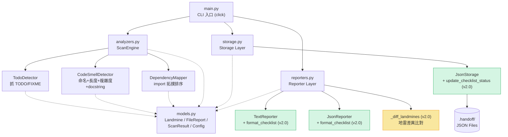
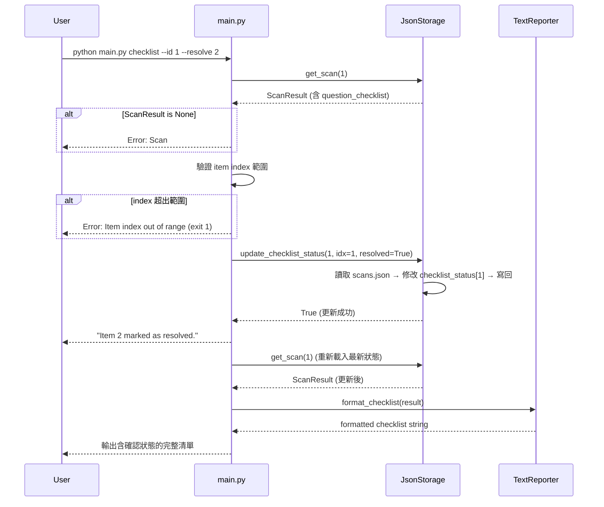
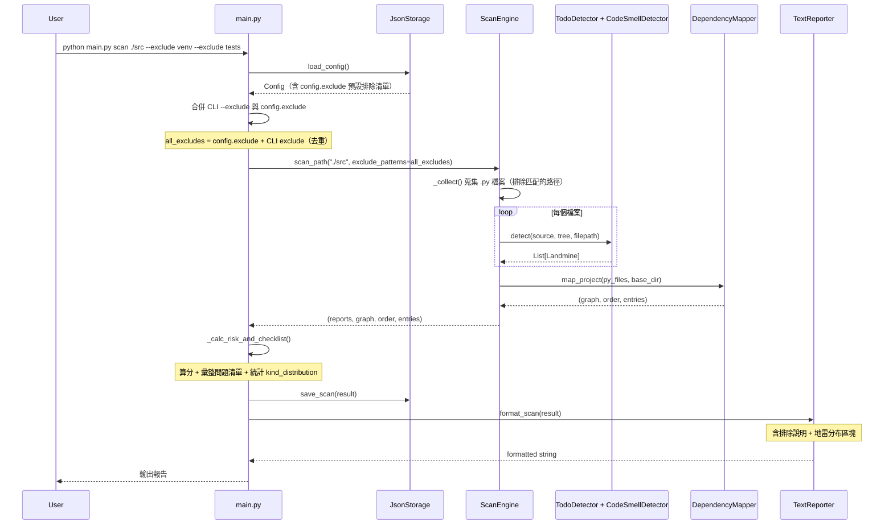

# handoff v2.0 — Software Design Document (SDD)

## 1. 專案概覽（Project Overview）

- **程式名稱**：handoff
- **版本**：v2.0
- **一句話描述（Elevator Pitch）**：一個 Python CLI 工具，在你接手別人的程式碼之前幫你「掃雷」——自動找出 TODO 沒做完、函式沒寫 docstring、命名亂七八糟等交接地雷，同時根據 import 依賴產生建議閱讀順序，最後輸出一份「交接問題清單」讓你可以直接拿去找前手確認。
- **目標使用者**：需要接手學長姊或離職同事專案的工程師、實習生，以及要快速評估學生程式碼品質的助教。
- **核心價值**：
  - **地雷偵測**：不只看 code style，還會抓 TODO/FIXME 未完成標記、缺少 docstring 的 public API、過長函式、過高複雜度——這些才是交接時真正會炸的東西。
  - **交接問題清單**：每顆地雷都附帶一句「建議問前手的問題」，彙整成 checklist，可以直接拿去跟學長姊對帳。
  - **閱讀導航**：用拓撲排序產生「該從哪個檔案開始讀」的建議順序，並標記 entry point，讓新人不用瞎猜。
  - **歷史追蹤**：每次掃描自動存檔，可以比較修復前後的風險分數變化，確認地雷真的有排掉。

### v2.0 新增價值

  - **掃描排除規則**：使用者可透過 `--exclude` 指定要跳過的路徑（如 `venv/`、`tests/`），也能寫入設定檔作為預設值，減少報告中的雜訊。
  - **地雷類型分布統計**：報告新增分布區塊，一眼看出專案最集中的問題類型，而不只是一個總分。
  - **地雷差異追蹤**：`compare` 指令能追蹤到個別地雷層級，明確列出哪些被修復、哪些是新增。
  - **交接問題確認追蹤**：新增 `checklist` 指令，讓接手者逐條標記確認狀態，狀態可持久化保存。

---

## 2. CLI 介面規格（Interface Specification）

### `python main.py <command> [options]`

| 指令 | 參數 / 旗標 | 說明 | 範例 |
|---|---|---|---|
| `scan` | `PATH`（必填） | 掃描指定檔案或目錄，找出交接地雷 | `python main.py scan ./src` |
| | `--format text\|json` | 輸出格式，預設 `text` | `python main.py scan main.py --format json` |
| | `--output FILE` / `-o FILE` | 將報告寫入檔案 | `python main.py scan . -o report.txt` |
| | `--exclude PATTERN`（v2.0，可多次） | 排除符合模式的路徑，支援萬用字元 | `python main.py scan . --exclude venv --exclude tests` |
| `report` | `--id INT` | 顯示指定 ID 的歷史掃描報告 | `python main.py report --id 3` |
| | `--latest` | 顯示最近一次掃描報告 | `python main.py report --latest` |
| | `--format text\|json` | 輸出格式，預設 `text` | `python main.py report --latest --format json` |
| `history` | `--limit INT` | 列出歷史掃描紀錄，預設最多 10 筆 | `python main.py history --limit 5` |
| | `--format text\|json` | 輸出格式，預設 `text` | `python main.py history --format json` |
| `compare` | `ID1 ID2`（必填） | 比較兩次掃描結果，含地雷差異追蹤 | `python main.py compare 1 2` |
| | `--format text\|json` | 輸出格式，預設 `text` | `python main.py compare 1 2 --format json` |
| `config` | `--show` | 顯示目前設定（含排除清單） | `python main.py config --show` |
| | `--set KEY=VALUE` | 修改閾值設定或排除清單 | `python main.py config --set max_complexity=15` |
| | | 設定排除清單 | `python main.py config --set exclude=venv` |
| `checklist`（v2.0 新增） | `--id INT`（必填） | 列出指定掃描的交接問題清單 | `python main.py checklist --id 1` |
| | `--resolve INDEX` | 將指定項目標記為已確認 | `python main.py checklist --id 1 --resolve 2` |
| | `--reset INDEX` | 將指定項目改回未確認 | `python main.py checklist --id 1 --reset 2` |
| | `--format text\|json` | 輸出格式，預設 `text` | `python main.py checklist --id 1 --format json` |

### 全域選項

| 旗標 | 說明 |
|---|---|
| `--version` | 顯示版本號 |
| `--help` | 顯示指令說明 |

---

## 3. 資料模型（Data Model）

### Landmine（地雷）

交接時可能出問題的每一個點，都是一顆地雷。

| 欄位 | 型別 | 說明 | 必填 |
|---|---|---|---|
| kind | str | 地雷類型（`todo` / `missing_docstring` / `naming` / `long_func` / `high_complexity` / `syntax_error`） | ✅ |
| filepath | str | 所在檔案 | ✅ |
| line | int | 行號 | ✅ |
| message | str | 問題描述 | ✅ |
| severity | str | 嚴重程度（`low` / `medium` / `high`），預設 `medium` | ✅ |
| suggested_question | str | 建議問前手的問題，用於交接問題清單 | ❌ |

### FileReport（檔案報告）

| 欄位 | 型別 | 說明 | 必填 |
|---|---|---|---|
| filepath | str | 檔案路徑 | ✅ |
| line_count | int | 有效程式碼行數 | ✅ |
| function_count | int | 函式數 | ✅ |
| class_count | int | 類別數 | ✅ |
| has_entry_point | bool | 是否有 `if __name__ == "__main__"` | ✅ |
| landmines | List[Landmine] | 該檔案的地雷清單 | ✅ |
| risk_level | str | 風險等級（`low` / `medium` / `high`） | ✅ |
| metadata | Dict[str, Any] | 擴充用 | ❌ |

### ScanResult（掃描結果）

| 欄位 | 型別 | 說明 | 必填 | 版本 |
|---|---|---|---|---|
| id | int | 唯一識別碼，自動遞增 | ✅ | v1.0 |
| target_path | str | 掃描目標路徑 | ✅ | v1.0 |
| timestamp | str | 掃描時間（`YYYY-MM-DD HH:MM:SS`） | ✅ | v1.0 |
| file_count | int | 掃描檔案數 | ✅ | v1.0 |
| total_lines | int | 總有效行數 | ✅ | v1.0 |
| total_landmines | int | 地雷總數 | ✅ | v1.0 |
| risk_score | float | 風險分數（0–100，越高越安全） | ✅ | v1.0 |
| file_reports | List[FileReport] | 各檔案報告 | ✅ | v1.0 |
| reading_order | List[str] | 建議閱讀順序 | ✅ | v1.0 |
| dep_graph | Dict[str, List[str]] | 內部 import 依賴圖 | ✅ | v1.0 |
| entry_points | List[str] | 入口點檔案 | ✅ | v1.0 |
| question_checklist | List[str] | 交接問題清單 | ✅ | v1.0 |
| kind_distribution | Dict[str, int] | 各地雷類型的數量統計 | ✅ | **v2.0** |
| checklist_status | List[bool] | 各問題項目的確認狀態 | ✅ | **v2.0** |
| excluded_patterns | List[str] | 本次掃描排除的路徑模式 | ❌ | **v2.0** |
| metadata | Dict[str, Any] | 擴充用 | ❌ | v1.0 |

### Config（設定）

| 欄位 | 型別 | 說明 | 預設值 | 版本 |
|---|---|---|---|---|
| thresholds.max_complexity | int | 圈複雜度警示閾值 | 10 | v1.0 |
| thresholds.max_function_length | int | 函式長度警示閾值 | 50 | v1.0 |
| thresholds.naming_convention | str | 命名慣例標準 | `"snake_case"` | v1.0 |
| exclude | List[str] | 預設排除路徑模式 | `[]` | **v2.0** |
| metadata | Dict[str, Any] | 擴充用 | `{}` | v1.0 |

---

## 4. 模組架構（Module Design）

### 系統架構圖



### checklist 指令流程圖（v2.0 最複雜的新功能）



### scan 指令流程圖（含 v2.0 排除規則與分布統計）



### 模組職責

| 模組 | 職責 | v2.0 變更 |
|---|---|---|
| `main.py` | CLI 入口、計算風險分數、彙整問題清單 | 新增 `--exclude` 選項、`checklist` 指令、`kind_distribution` 計算、`config --set exclude=...` |
| `models.py` | 定義 `Landmine`、`FileReport`、`ScanResult`、`Config` | `ScanResult` 新增 `kind_distribution`、`checklist_status`、`excluded_patterns`；`Config` 新增 `exclude` |
| `analyzers.py` | 地雷偵測引擎，含 `TodoDetector`、`CodeSmellDetector`、`DependencyMapper`、`ScanEngine` | `_collect()` 新增排除模式過濾，`scan_path()` 接受 `exclude_patterns` 參數 |
| `reporters.py` | 輸出格式化，Text 和 JSON 兩種 | 新增 `format_checklist()` 方法、`format_scan()` 新增分布區塊、`format_comparison()` 新增地雷差異追蹤、新增 `_diff_landmines()` 輔助函式 |
| `storage.py` | 資料持久化 | 新增 `update_checklist_status()` 方法 |

---

## 5. 錯誤處理規格（Error Handling）

| 情境 | 預期行為 | 退出碼 | 版本 |
|---|---|---|---|
| 指定路徑不存在 | stderr 輸出 `Error: Path not found: <path>` | 1 | v1.0 |
| 路徑下無 `.py` 檔案 | stderr 輸出 `Error: No Python files found in: <path>` | 1 | v1.0 |
| `report` 未指定 `--id` 或 `--latest` | stderr 輸出 `Error: Specify --id INT or --latest` | 2 | v1.0 |
| 指定的 Scan ID 不存在 | stderr 輸出 `Error: Scan not found` | 1 | v1.0 |
| `compare` 某 ID 不存在 | stderr 輸出 `Error: Scan #<id> not found` | 1 | v1.0 |
| `config --set` 格式錯 | stderr 輸出 `Error: Use format KEY=VALUE` | 2 | v1.0 |
| `config` 未指定操作 | stderr 輸出 `Error: Specify --show or --set KEY=VALUE` | 2 | v1.0 |
| 目標檔案有語法錯誤 | 該檔案記錄一顆 `syntax_error` 地雷，其餘指標為 0，不中斷整體掃描 | 0 | v1.0 |
| `checklist --id` 指定的 Scan ID 不存在 | stderr 輸出 `Error: Scan #<id> not found` | 1 | **v2.0** |
| `checklist --resolve` 的 index 超出範圍 | stderr 輸出 `Error: Item index <n> out of range` | 1 | **v2.0** |
| `checklist --reset` 的 index 超出範圍 | stderr 輸出 `Error: Item index <n> out of range` | 1 | **v2.0** |

---

## 6. 測試案例（Test Cases）

> 工作目錄為 `v2/`，已執行 `pip install -r requirements.txt`。

### v1.0 回歸測試（全部保留）

| # | 輸入指令 | 預期輸出 | 通過條件 |
|---|---|---|---|
| 1 | `python main.py scan main.py` | 交接報告 | stdout 含 `Handoff Report` 且含 `Risk Score` 且退出碼 0 |
| 2 | `python main.py scan nonexistent_path` | 錯誤訊息 | stderr 含 `Error: Path not found` 且退出碼 1 |
| 3 | `python main.py scan main.py --format json` | JSON 報告 | stdout 為合法 JSON 且含 `"risk_score"` 且退出碼 0 |
| 4 | `python main.py history` | 歷史紀錄 | stdout 含 `ID` 與 `Target` 表頭且退出碼 0 |
| 5 | `python main.py report --latest` | 最近報告 | stdout 含 `Handoff Report` 且退出碼 0 |
| 6 | `python main.py config --show` | 目前設定 | stdout 含 `max_complexity` 且退出碼 0 |
| 7 | `python main.py config --set max_complexity=15` | 更新設定 | stdout 含 `Config updated` 且退出碼 0 |
| 8 | `python main.py report --id 999` | 找不到 | stderr 含 `Error: Scan not found` 且退出碼 1 |
| 9 | `python main.py scan .` | 掃描目錄 | stdout 含 `Handoff Report` 且 `Files scanned` ≥ 1 且含 `Suggested Reading Order` 且退出碼 0 |
| 10 | `python main.py --version` | 版本號 | stdout 含版本號且退出碼 0 |

### v2.0 新增測試

| # | 輸入指令 | 預期輸出 | 通過條件 |
|---|---|---|---|
| 11 | `python main.py scan ./test_proj --exclude venv --exclude tests` | 排除報告 | stdout 含 `Excluded patterns` 且 `venv/` 下檔案不出現在結果中 |
| 12 | `python main.py config --set exclude=venv` | 設定排除 | stdout 含 `Config updated` |
| 13 | `python main.py config --show` | 含排除清單 | stdout 含 `exclude` 且退出碼 0 |
| 14 | `python main.py scan .` | 含分布統計 | stdout 含 `Landmine Distribution` 且含 `MOST COMMON` |
| 15 | `python main.py scan main.py --format json` | JSON 含分布 | JSON 輸出含 `"kind_distribution"` |
| 16 | `python main.py compare 1 2` | 地雷差異 | stdout 含 `[FIXED]` 或 `[NEW]` 或「無新增或修復的地雷」 |
| 17 | `python main.py checklist --id 1` | 問題清單 | stdout 含 `Checklist` 且含編號 且含「未確認」 |
| 18 | `python main.py checklist --id 1 --resolve 1` | 標記確認 | stdout 含 `marked as resolved` 且含「已確認」 |
| 19 | `python main.py checklist --id 1 --reset 1` | 取消確認 | stdout 含 `marked as unresolved` 且含「未確認」 |
| 20 | `python main.py checklist --id 999` | 不存在 | stderr 含 `Error: Scan #999 not found` 且退出碼 1 |
| 21 | `python main.py report --id <舊版ID>` | 舊紀錄不崩潰 | 程式正常顯示報告，即使缺少 v2.0 新欄位，退出碼 0 |

---

## 7. 計分邏輯（Risk Scoring Algorithm）

> 此邏輯與 v1.0 完全相同，未做任何修改。

每個檔案起始分數 100 分。每顆地雷依嚴重程度扣分：

| 嚴重程度 | 權重 | 扣分計算 |
|---|---|---|
| high | 5 | 權重 × 2 = 10 分/顆 |
| medium | 3 | 權重 × 2 = 6 分/顆 |
| low | 1 | 權重 × 2 = 2 分/顆 |

單檔分數最低為 0。檔案風險等級依分數劃分：分數 < 50 為 `high`，50–79 為 `medium`，≥ 80 為 `low`。

最終 `risk_score` 為所有檔案分數的算術平均，四捨五入至一位小數。

### 交接問題清單的產生

掃描完成後，從所有嚴重度為 `high` 或 `medium` 的地雷中，取出其 `suggested_question` 欄位，加上檔案名稱前綴，彙整成交接問題清單。

### v2.0 新增：地雷類型分布統計

在計算風險分數的同時，統計每種 `kind` 出現的次數，存入 `ScanResult.kind_distribution`。Text 報告中以橫條圖呈現，並標記數量最多的類型為 `◀ MOST COMMON`。

---

## 8. 依賴圖與閱讀順序（Dependency Mapping）

> 此邏輯與 v1.0 完全相同，未做任何修改。

### 演算法

1. **模組對映**：把每個 `.py` 的相對路徑轉成 Python 模組名。
2. **依賴圖**：對每個檔案解析 AST 裡的 `import` / `from ... import`，只看專案內部的依賴，建立有向圖。
3. **拓撲排序**：用 Kahn's algorithm，從入度 0 的檔案開始排。
4. **入口點偵測**：標記含有 `if __name__ == "__main__"` 的檔案。

---

## 9. 儲存格式（Storage Format）

| 檔案 | 內容 | 格式 | 版本 |
|---|---|---|---|
| `.handoff/scans.json` | 所有歷史掃描結果 | JSON Array of ScanResult | v1.0 |
| `.handoff/config.json` | 使用者設定（含排除清單） | JSON Object (Config) | v1.0 / v2.0 擴充 |

### v2.0 儲存決策

**checklist_status 的儲存方式**：確認狀態直接附加在 `ScanResult` 的 `checklist_status` 欄位中，與原有的 `scans.json` 一起儲存，不另開新檔案。

**選擇理由**：
1. checklist_status 與 question_checklist 有強耦合關係（一一對應），放在同一筆記錄中語義最清晰。
2. 避免引入額外的檔案同步問題——如果分開儲存，刪除掃描記錄時可能忘記刪除對應的 checklist 檔案。
3. 缺點是更新一條 checklist 需要重寫整個 scans.json，但在目前的使用規模下（掃描記錄通常不超過數百筆），效能影響可忽略。

**關於同時操作的取捨**：本系統不支援即時的多人同步。如果兩個人同時修改同一份清單，後寫入的會覆蓋先寫入的（last-write-wins）。這是因為 handoff 的主要使用場景是一對一的交接對帳，不太需要多人同時操作。如果未來有此需求，可以改用 SQLite 加上行級鎖定。

---

## 10. 地雷差異追蹤設計（v2.0 新增）

### 「同一顆地雷」的判斷標準

使用 `(kind, basename(filepath), message)` 三元組作為地雷的身份識別鍵：

- **kind**：地雷類型必須相同（如 `todo`、`missing_docstring`）。
- **basename(filepath)**：使用檔名而非完整路徑，以容忍目錄結構的小幅變動（例如從 `src/utils.py` 搬到 `lib/utils.py`）。
- **message**：訊息內容包含函式名稱等具體資訊，能區分同一檔案中不同函式的同類問題。

### 不使用行號的原因

行號在程式碼編輯後極易偏移——在問題程式碼上方新增幾行空行，行號就會改變，但地雷本身沒有消失。因此不將行號納入身份比對。

### 邊界情況說明

| 情境 | 處理方式 |
|---|---|
| 檔案被重新命名 | 如果只是路徑變更但 basename 不變，仍視為同一顆；如果 basename 也變了，會被判為「舊地雷消失 + 新地雷出現」 |
| 程式碼搬移導致行號偏移 | 不影響判斷（不使用行號比對） |
| 同一檔案同一函式出現多顆同類型地雷 | 因為 message 不同（包含函式名），通常仍可正確區分 |
| 同一函式被拆分或合併 | 可能導致誤判，這是已知限制 |

---

## 11. 排除規則設計（v2.0 新增）

### 排除來源的合併邏輯

CLI 的 `--exclude` 參數與設定檔中的 `config.exclude` 會被合併使用，採取「聯集去重」策略：

```
實際排除清單 = 去重(config.exclude + CLI --exclude)
```

報告開頭會列出「Excluded patterns」，讓使用者清楚本次實際排除了哪些路徑模式。

### 匹配邏輯

使用 Python 標準庫 `fnmatch` 進行萬用字元匹配（支援 `*`、`?`、`[seq]` 等模式）。匹配對象為路徑中的每一層目錄名或檔案名。例如 `--exclude test_*` 會排除所有名稱以 `test_` 開頭的目錄和檔案。

---

## 12. 向下相容性設計（Backward Compatibility）

### 保留的 v1.0 介面

| v1.0 指令 | v2.0 行為 | 是否相容 |
|---|---|---|
| `scan PATH` | 行為不變，新增可選的 `--exclude`，不影響無參數使用 | ✅ 完全相容 |
| `scan PATH --format text\|json` | 行為不變，Text 格式新增分布區塊但不影響原有內容 | ✅ 完全相容 |
| `scan PATH --output FILE` | 行為不變 | ✅ 完全相容 |
| `report --id INT` | 行為不變，舊紀錄缺少 v2 欄位時使用預設值 | ✅ 完全相容 |
| `report --latest` | 行為不變 | ✅ 完全相容 |
| `history --limit INT` | 行為不變 | ✅ 完全相容 |
| `compare ID1 ID2` | 行為不變，新增地雷差異區塊為額外輸出 | ✅ 完全相容 |
| `config --show` | 行為不變，新增顯示排除清單 | ✅ 完全相容 |
| `config --set KEY=VALUE` | 行為不變，新增支援 `exclude` key | ✅ 完全相容 |
| `--version` | 行為不變，輸出 `1.0.0` | ✅ 完全相容 |
| `--help` | 行為不變，新增 `checklist` 指令說明 | ✅ 完全相容 |

### 資料向下相容

- `ScanResult.from_dict()` 使用 `known fields` 過濾，舊紀錄缺少的 v2.0 欄位會自動使用 dataclass 預設值。
- `checklist_status` 若不存在，在 `from_dict()` 中自動初始化為與 `question_checklist` 等長的 `[False, ...]`。
- `Config.from_dict()` 同樣使用 `known fields` 過濾，舊設定檔缺少 `exclude` 欄位時預設為空清單。

### 破壞性變更（Breaking Changes）

本版本無破壞性變更。所有 v1.0 的 CLI 指令、參數名稱、輸出格式、錯誤訊息與退出碼均保持不變。
