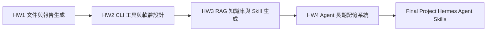
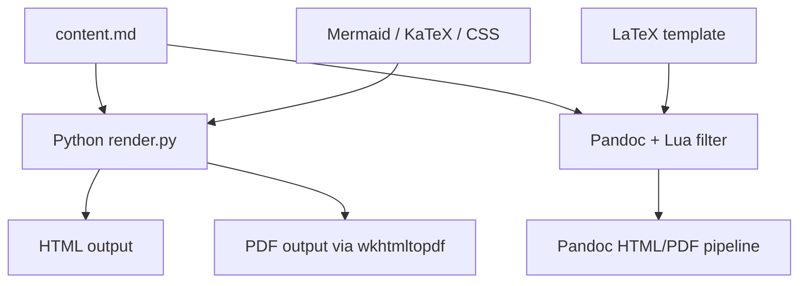
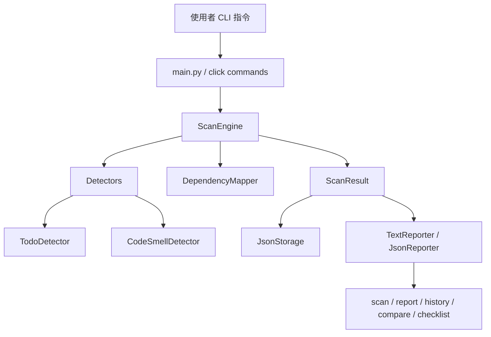
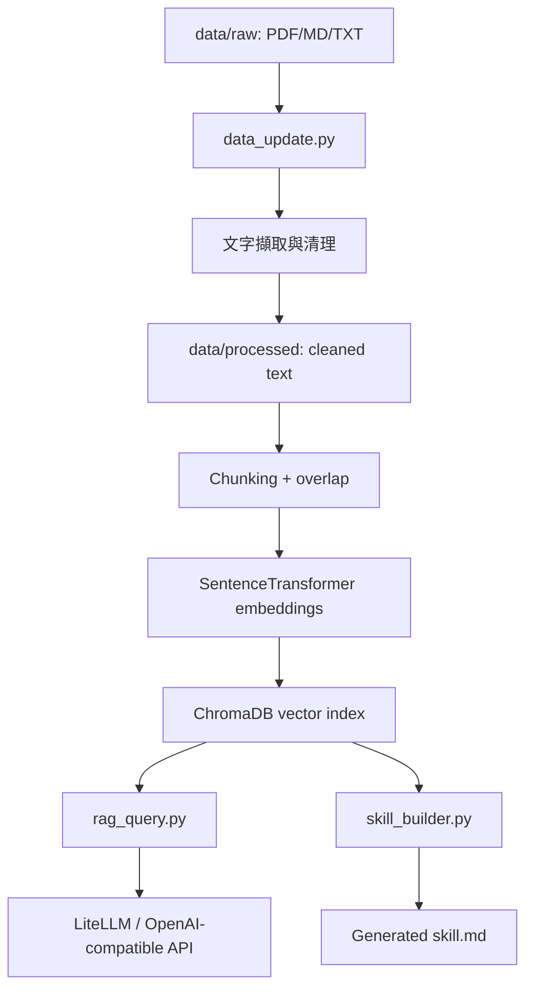
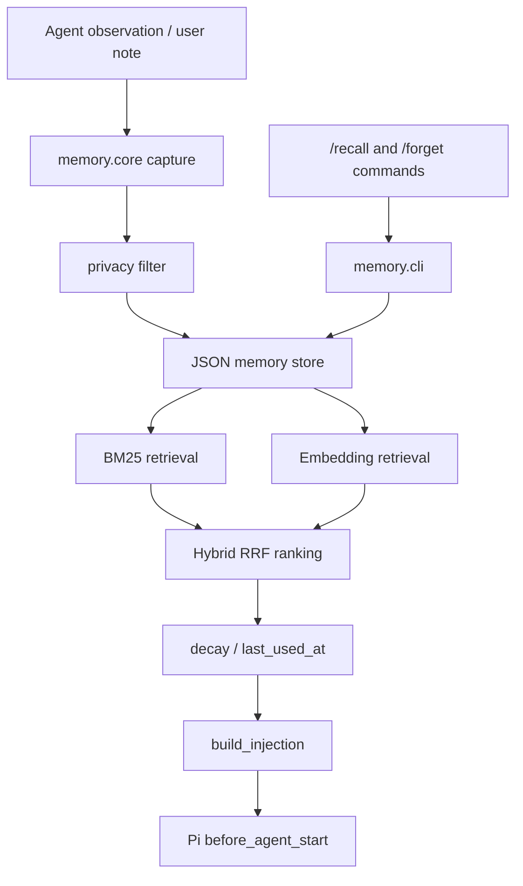
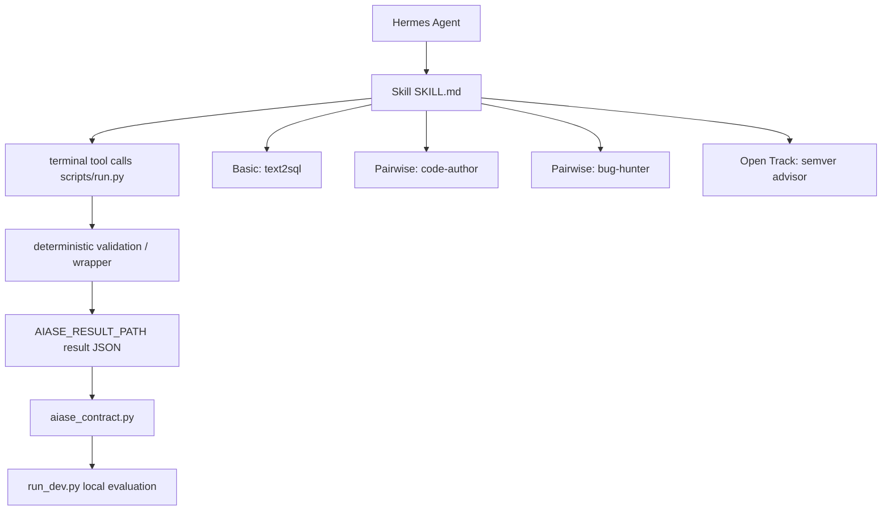

# TAICA AIASE 2026 作業總覽

本 repository 收錄「生成式 AI 應用系統與工程 / AIASE 2026」課程的完整作業與期末專案。整體脈絡從基礎文件產生、CLI 工具設計、RAG 知識庫、Agent 記憶系統，一路延伸到 Hermes Agent Skill 與自動評測框架。

這份 README 是整個 repo 的入口導覽，目標是讓第一次進來的人能快速回答三件事：

- 這門課在訓練什麼能力
- 每份作業做了什麼、如何組成
- 要看細節或執行時應該從哪個資料夾開始

## 課程主軸

本課程聚焦於生成式 AI 系統從「單次提示」走向「可工程化、可驗證、可重用」的完整流程。作業安排大致沿著下列能力逐步堆疊：



| 項目 | 主題 | 核心能力 | 入口 |
|---|---|---|---|
| HW1 | Markdown 文件轉譯與報告生成 | 文件格式處理、HTML/PDF 輸出、Mermaid/LaTeX 支援 | [HW1/README.md](HW1/README.md) |
| HW2 | handoff 程式碼交接避雷工具 | CLI 設計、靜態分析、版本演進、設計決策說明 | [HW2/README.md](HW2/README.md) |
| HW3 | Image Restoration RAG 知識庫 | 論文資料清理、chunking、embedding、ChromaDB、RAG 問答、Skill 生成 | [HW3/](HW3/) |
| HW4 | Pi Memory 長期記憶系統 | Agent memory、BM25/Hybrid retrieval、privacy filter、decay、Pi bridge | [HW4/README.md](HW4/README.md) |
| Final Project | Hermes Agent Skill 評測專案 | Text2SQL、Pairwise coding skills、Open Track SemVer Advisor、file-based grading | [FinalProject/README.md](FinalProject/README.md) |

## Repository 架構

```text
TAICA_AIASE2026/
├── README.md
├── HW1/
│   ├── content.md
│   ├── render.py
│   ├── mermaid.lua
│   ├── pandoc-template.tex
│   └── output/
├── HW2/
│   ├── v1/
│   ├── v2/
│   └── README.md
├── HW3/
│   ├── data/
│   │   ├── raw/
│   │   └── processed/
│   ├── data_update.py
│   ├── rag_query.py
│   └── skill_builder.py
├── HW4/
│   ├── memory/
│   ├── tests/
│   ├── benchmark/
│   ├── demo/
│   ├── pi-bridge/
│   ├── README.md
│   └── REPORT.md
└── FinalProject/
    ├── skills/
    ├── dev_set/
    ├── tests/
    ├── run_dev.py
    ├── aiase_contract.py
    ├── README.md
    └── report.md
```

## HW1：Markdown 文件轉譯與報告生成

HW1 建立一個 Markdown 報告轉譯流程，將 `content.md` 轉成 HTML 與 PDF，並支援常見技術文件元素，例如 Mermaid 圖表、LaTeX 數學式、程式碼區塊與中文排版。



重點內容：

- `render.py`：主要 Python 渲染流程，負責把 Markdown 轉為可閱讀的 HTML/PDF。
- `content.md`：作業報告本文。
- `mermaid.lua`、`mermaid-header.html`：Pandoc 與 Mermaid 整合。
- `pandoc-template.tex`：PDF 輸出使用的 LaTeX template。
- `output/`：已產出的 HTML/PDF 結果。

可以從 [HW1/README.md](HW1/README.md) 查看安裝需求、執行指令與輸出檔案說明。

## HW2：handoff 程式碼交接避雷工具

HW2 實作一個名為 `handoff` 的 Python CLI，用來掃描 Python 專案並找出交接時容易踩到的「地雷」，例如 TODO/FIXME、缺少 docstring、命名問題、過長函式、過高複雜度與語法錯誤。作業同時包含 v1 到 v2 的設計演進說明。



v1 主要建立基本掃描、報告、歷史紀錄、比較與設定功能；v2 進一步加入：

- `--exclude` 排除規則
- landmine 類型統計
- checklist 交接問題追蹤
- 比較報告中的地雷差異
- dataclass 向下相容讀取

主要資料夾：

- [HW2/v1](HW2/v1)：第一版 CLI 工具。
- [HW2/v2](HW2/v2)：擴充後版本，包含 checklist 與 exclude 等功能。
- [HW2/README.md](HW2/README.md)：完整設計決策、v1/v2 差異、風險與改進方向。

## HW3：Image Restoration RAG 知識庫

HW3 建立一套針對 Image Restoration 論文的 RAG 系統。原始 PDF 因檔案過大不放入 repo，但已提供清理後的 processed text，可直接重建向量索引並進行問答。



系統包含三個主要流程：

- `data_update.py`：讀取 raw 或 processed 資料，進行清理、chunking、embedding，並寫入 ChromaDB。
- `rag_query.py`：提供互動式或單次查詢 RAG 問答，回答時要求附上來源引用。
- `skill_builder.py`：對知識庫發出探索性問題，彙整 RAG context，自動生成 Image Restoration 研究助理用的 `skill.md`。

資料內容涵蓋約 30 篇影像復原相關論文，主題包括：

- denoising、super-resolution、deblurring、deraining、dehazing
- CNN、GAN、Transformer、Mamba、Diffusion-based restoration
- SwinIR、Restormer、Uformer、PromptIR、OneRestore、RestoreAgent 等方法
- PSNR、SSIM、LPIPS、benchmark datasets 與訓練策略

## HW4：Pi Memory 長期記憶系統

HW4 為 coding agent Pi 設計長期記憶系統，讓 agent 能跨 session 記住專案偏好、技術決策與使用者指令，並在新任務開始前自動召回相關記憶。



主要模組：

- `memory/store.py`：JSON 儲存、SHA-256 id、atomic write。
- `memory/bm25.py`：Okapi BM25 檢索。
- `memory/hybrid.py`：BM25 + embedding 的 hybrid retrieval，使用 RRF 合併排名。
- `memory/privacy.py`：遮蔽 API key、token、password 等敏感資訊。
- `memory/decay.py`：依時間衰減記憶權重，並在使用後更新 `last_used_at`。
- `memory/core.py`：capture、retrieve、build_injection、forget 等核心 API。
- `memory/cli.py`：提供 list、capture、forget 等命令。
- `pi-bridge/extension.ts`：與 Pi extension 串接，在 agent start 前注入記憶，並支援 `/recall`、`/forget`。

HW4 也包含完整測試、benchmark 與 demo 截圖：

- [HW4/tests](HW4/tests)
- [HW4/benchmark](HW4/benchmark)
- [HW4/demo](HW4/demo)
- [HW4/REPORT.md](HW4/REPORT.md)

## Final Project：Hermes Agent Skill 評測專案

期末專案以 Hermes Agent 為執行環境，實作多個可被自動評測的 Agent Skills。核心設計原則是「deterministic shell wrapping probabilistic core」：LLM 負責推理或產生候選答案，最後的格式、驗證、寫檔與契約輸出交給確定性的 Python script 控制。



實作的 tracks：

- **Basic / Text2SQL**：將自然語言問題轉成 SQL，並用 SQLite `EXPLAIN` 檢查語法、schema 與唯讀限制。
- **Pairwise / Code Author**：根據題目撰寫 Python 函式，並以 self-test、SLOC、import 限制等方式檢查。
- **Pairwise / Bug Hunter**：分析候選程式，透過 AST 與邊界輸入實跑找出潛在 bug。
- **Open Track / SemVer Advisor**：比較 Python 模組新舊版本的 public API surface，判斷 major/minor/patch 並產生 changelog。

期末專案的重要特色：

- 採用課程 2026-06 file-based 輸出規格。
- 每個 skill 透過 `scripts/run.py` 或 `advise.py` 原子寫入 `$AIASE_RESULT_PATH`。
- `aiase_contract.py` 作為本地與評分器共用的比對核心。
- Open Track 的 SemVer 判斷使用 AST 確定性分析，降低模型隨機性。
- 提供 `tests/`、`run_dev.py`、`verify_repo.py` 做本地驗證。

可從以下文件深入閱讀：

- [FinalProject/README.md](FinalProject/README.md)：專案操作與 starter repo 說明。
- [FinalProject/report.md](FinalProject/report.md)：完整設計決策、失敗分析、實測結果與改進方向。
- [FinalProject/OPEN_TRACK.md](FinalProject/OPEN_TRACK.md)：Open Track 設計。
- [FinalProject/PAIRWISE_ROLE.md](FinalProject/PAIRWISE_ROLE.md)：Pairwise 角色宣告。

## 快速瀏覽建議

如果只是想理解整個 repo，建議閱讀順序如下：

1. 先看本 README 的「課程主軸」與「Repository 架構」。
2. 依序進入 [HW1](HW1/)、[HW2](HW2/)、[HW3](HW3/)、[HW4](HW4/) 看每份作業的 README 或主要 script。
3. 最後閱讀 [FinalProject/report.md](FinalProject/report.md)，它最能代表整門課後半段的 Agent engineering 重點。

如果想直接跑程式，請優先進入各作業資料夾閱讀其 `README.md` 或 script header，因為不同作業的依賴與外部工具不同。

## 整體學習成果

這個 repo 呈現的是一條從「會使用生成式 AI」到「能工程化生成式 AI 系統」的路徑：

- HW1 著重文件輸出與自動化報告流程。
- HW2 練習把需求轉成可維護的 CLI 工具與版本演進設計。
- HW3 建立可查詢、可引用、可生成 skill 的領域知識庫。
- HW4 把 agent 的短期互動延伸成可召回、可遺忘、可保護隱私的長期記憶。
- Final Project 將 skill、工具呼叫、確定性驗證與自動評測整合成完整 Agent 系統。

整體而言，這份作業集不只是把模型接上 API，而是嘗試把 LLM 放進可靠的軟體工程流程中：資料可追溯、輸出可驗證、工具可測試、行為可重現。
